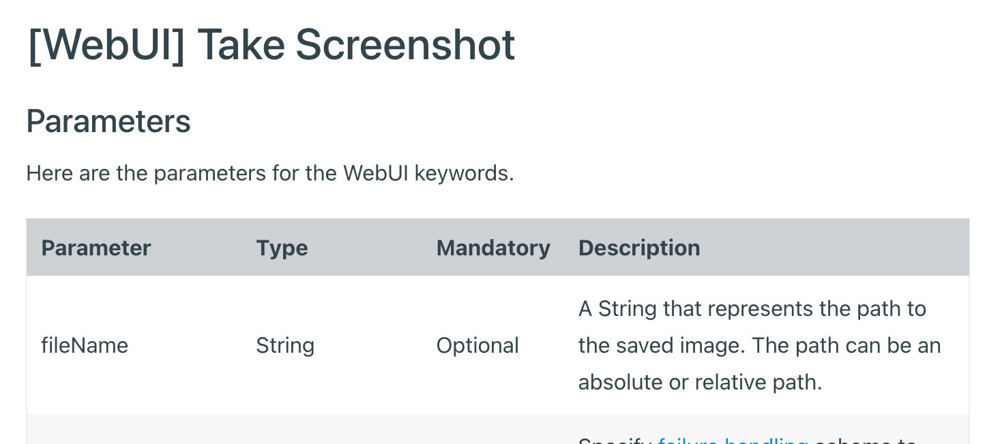

# Saving Screeenshots into the Folder you want in Katalon Studio

This is a Katalon Studio project for demonstration purpose.
You can download the zip from the [Releases](https://github.com/kazurayam/KS_saving_screenshots_into_the_folder_you_want/releases) page, unzip it, open it with Katalon Studio on your own PC. This project was tested using Katalon Studio v8.2.5, but it should work on any version.

This project was developed to propose a solution to a question raised in the Katalon User Forum

-   <https://forum.katalon.com/t/capture-screenshots/57005>

## Problem to solve

Katalon Studio provides a set of built-in keywords as documented in the ["Capture Screenshots"](https://docs.katalon.com/katalon-studio/docs/capture-screenshots.html). The doc describes only "how to take screenshots". It does not describe enough "how to manage the location of png files". For example, the document of WebUI.takeScreenshot() writes:

&gt;A String that represents the path to the saved image. The path can be an absolute or relative path.

Then, how can I save the PNG file into a specific location? For example, I want to create `<projectDir>/Reports/20220312_100912/baz.png`. As you know, the `<projectDir>/Reports/20220312_100912` folder is created by Katalon Studio dynamically. Therefore I can not write the folder names as a constant string literal in the script. I need to find out the folder path somehow.

## Solution

Katalon Studio API provides several classes + methods that helps to manage the location of PNG files as screenshot.

1.  [com.kms.katalon.core.configuration.RunConfiguration getProjectDir()](https://docs.katalon.com/javadoc/com/kms/katalon/core/configuration/RunConfiguration.html#getProjectDir())

2.  [com.kms.katalon.core.configuration.RunConfiguration getReportFolder()](https://docs.katalon.com/javadoc/com/kms/katalon/core/configuration/RunConfiguration.html#getReportFolder())

You want to use these API in a Test Listener. Then your Test Case scripts would be able to control where to save the screenshot images into the folder you want.

## Description

I will show you some sample codes step by step.

### TS1 specifying no subfolder

The following is the simplest example of using the built-in keyword `WebUI.takeScreenshot(String fileName)`.

    /*
     *  Test Cases/TC1_noFolder_foo.png
     */

    import com.kms.katalon.core.webui.keyword.WebUiBuiltInKeywords as WebUI

    // Open browser and navigate to AUT
    WebUI.openBrowser("http://demoaut.katalon.com")

    // Take screenshot
    File png = new File("foo.png")
    WebUI.takeScreenshot(png.toString())

    println "[TC1_noFolder_foo.png] png -> ${png.getCanonicalPath()}"

    // Close browser
    WebUI.closeBrowser()

When you run the Test Suite `TS1_noFolder_foo.png`, you will see a file `foo.png` immediately under the project folder.

In this case, a String `foo.png` is interpreted to be the file under the **current directory** recognized by OS when the program ran.

&gt;\[WARNING\] Katalon Studio 8.2.5 has a bug that it can not display newly created files immediately under the project folder. You need to close the project once and reopen it. Then the `foo.png` will be displayed. See <https://forum.katalon.com/t/katalon-studio-does-not-recognise-externally-added-files/61837>.

### TS2 specifying subfolders

You can create arbitrary sub-folders and save your screenshots in it. See the following example.

    /*
     * TS2_subfolders_bar.png
     */
    import com.kms.katalon.core.webui.keyword.WebUiBuiltInKeywords as WebUI

    // Open browser and navigate to AUT
    WebUI.openBrowser("http://demoaut.katalon.com")

    // Take screenshot
    WebUI.takeScreenshot("screenshot/sample/bar.png")

    // Close browser
    WebUI.closeBrowser()

When you run the Test Suite `TS2_subfolders_bar.png`, you will see the folder `screenshots/sample` is created, and inside it a file `bar.png` is saved.

### TS3 saving png files into the "Reports" folder

Now, let’s try to solve a practical scenario. I want to save a PNG file under the "Reports" folder.

First, you want to create a Test Listener.

    import com.kms.katalon.core.annotation.BeforeTestCase
    import com.kms.katalon.core.annotation.BeforeTestSuite
    import com.kms.katalon.core.configuration.RunConfiguration
    import com.kms.katalon.core.context.TestCaseContext
    import com.kms.katalon.core.context.TestSuiteContext

    class TL1 {
        
        public static String projectDir = RunConfiguration.getProjectDir()
        public static String reportFolder = RunConfiguration.getReportFolder()
        
        @BeforeTestSuite
        def sampleBeforeTestSuite(TestSuiteContext testSuiteContext) {
            println ""
            println "[${testSuiteContext.getTestSuiteId()}] projectDir  =${projectDir}"
            println "[${testSuiteContext.getTestSuiteId()}] reportFolder=${reportFolder}"
            println ""
        }
        
        @BeforeTestCase
        def sampleBeforeTestCase(TestCaseContext testCaseContext) {
            println ""
            println "[${testCaseContext.getTestCaseId()}] projectDir  =${projectDir}"
            println "[${testCaseContext.getTestCaseId()}] reportFolder=${reportFolder}"
            println ""
        }

    }

Please note that the `TL1` has a `static` property named `reportFolder`.

Katalon Studio always instantiate the `TL1` class before your Test Suites and Test Cases are activated. The `TL1` object sets an appropriate value into the `reportFolder` property using `RunConfiguration.getReportFolder()` method.

Then your Test Case `TC3_reportFolder` will refer to the `reportFolder` property of `TL1` object.

    /*
     * TC3_reportFolder_baz.png
     */
    import java.nio.file.Path
    import java.nio.file.Paths

    import com.kms.katalon.core.webui.keyword.WebUiBuiltInKeywords as WebUI

    // Open browser and navigate to AUT
    WebUI.openBrowser("http://demoaut.katalon.com")

    // Take screenshot
    Path reportFolder = Paths.get(TL1.reportFolder)   // Test Listener/TL1 is constructed by Katalon Studio before this test case script runs
    Path pngFile = reportFolder.resolve("baz.png")
    WebUI.takeScreenshot(pngFile.toString())

    // Close browser
    WebUI.closeBrowser()

When you run the Test Suite `TS3_reportFolder_baz.png`, will see a file `baz.png` is created in the `Reports` folder.

However, you can never see the `baz.png` file in the `Reports` in the Katalon Studio GUI.

This is by design. Katalon Studio does not expect users to save arbitrary files in the `Reports` folder. KS does not display any **unknown** files in the `Reports` folder.

### How `reportFolder` is set when you run Test Case

When you run the Test Suite `TS3_reportsFolder_baz.png`, you will see the following messages in the Console.

    2022-03-12 11:27:09.118 INFO  c.k.katalon.core.main.TestSuiteExecutor  - START Test Suites/TS3_reportFolder_baz.png
    ...
    [Test Suites/TS3_reportFolder_baz.png] projectDir  =/Users/kazuakiurayama/katalon-workspace/KS_saving_screenshots_into_the_folder_you_want
    [Test Suites/TS3_reportFolder_baz.png] reportFolder=/Users/kazuakiurayama/katalon-workspace/KS_saving_screenshots_into_the_folder_you_want/Reports/20220312_112659/TS3_reportFolder_baz.png/20220312_112659

    2022-03-12 11:27:09.670 INFO  c.k.katalon.core.main.TestCaseExecutor   - --------------------
    2022-03-12 11:27:09.670 INFO  c.k.katalon.core.main.TestCaseExecutor   - START Test Cases/TC3_reportFolder_baz.png

    [Test Cases/TC3_reportFolder_baz.png] projectDir  =/Users/kazuakiurayama/katalon-workspace/KS_saving_screenshots_into_the_folder_you_want
    [Test Cases/TC3_reportFolder_baz.png] reportFolder=/Users/kazuakiurayama/katalon-workspace/KS_saving_screenshots_into_the_folder_you_want/Reports/20220312_112659/TS3_reportFolder_baz.png/20220312_112659

On the other hand, when you choose the Test Case `TC3_reportsFolder_baz.png` and run it, you will see the following messages.

    2022-03-12 11:30:57.229 INFO  c.k.katalon.core.main.TestCaseExecutor   - --------------------
    2022-03-12 11:30:57.233 INFO  c.k.katalon.core.main.TestCaseExecutor   - START Test Cases/TC3_reportFolder_baz.png

    [Test Cases/TC3_reportFolder_baz.png] projectDir  =/Users/kazuakiurayama/katalon-workspace/KS_saving_screenshots_into_the_folder_you_want
    [Test Cases/TC3_reportFolder_baz.png] reportFolder=/var/folders/7m/lm7d6nx51kj0kbtnsskz6r3m0000gn/T/Katalon/Test Cases/TC3_reportFolder_baz.png/20220312_113053

Please remark the difference how the `reportFolder` property is set when you ran the Test Case (not the Test Suite).

    reportFolder = /var/folders/7m/lm7d6nx51kj0kbtnsskz6r3m0000gn/T/Katalon/Test Cases/TC3_reportFolder_baz.png/20220312_113053

When you choose a Test Case, the `reportFolder` will have a path of temporary directory. This is because Katalon Studio creates a "Report" only for a Test Suite; it does not create "Report" for a Test Case. Thefore the `reportFolder` is given with a harmless value. You are not supposed to refer to it.

## Conclusion

The `TL1` an `TC3_reportFolder_baz.png` shows you how to save a screenshot into Katalon’s "Reports" folder.

## Discussion: Wouldn’t it be nice if …​

I named screenshot image files as `foo.png`, `bar.png`, `baz.png`. This works. But these names aren’t useful. My script may name the screenshot of URL `http://demoaut.katalon.com/` as `foo.png`. But another script would never be informed that `foo.png` was created out of `http://demoaut.katlaon.com/`. Therefore the file `foo.png` can not be reused. It becomes a garbage as soon as created.

Then, wouldn’t it be nice if we can save a screenshot with the file name just the same as the source `http://demoaut.katalon.com/`? like this:

As we all know, this is impossible. We can not use the character `/` as a part of a file name on Windows, Mac, Linux. Here we find another problem in taking screenshots.

**How the image files should be named? How can we record the information from which URL each screenshots were taken?** --- This is the reason why I have developed my library [materialstore](https://github.com/kazurayam/materialstore).

@author kazurayam
@date 12 MAR 2022
