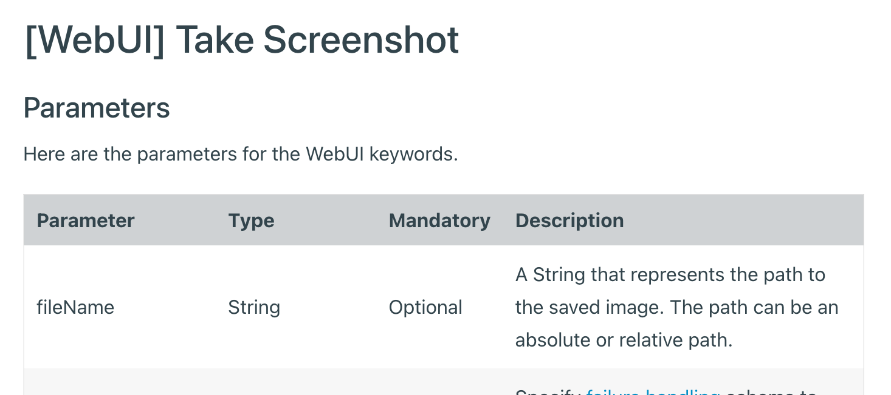

= Saving Screeenshots into the Folder you want in Katalon Studio

This is a Katalon Studio project for demonstration purpose.
You can download the zip from the [Releases] page, unzip it, open it with Katalon Studio on your own PC.

This project was test using Katalon Studio v8.2.5, but it should work on any version.

This project was developed to propose a solution to a question raised in the Katalon User Forum

* https://forum.katalon.com/t/capture-screenshots/57005

== Problem to solve

Katalon Studio provides a set of built-in keywords as documented in the https://docs.katalon.com/katalon-studio/docs/capture-screenshots.html["Capture Screenshots"]. The doc describes only "how to take screenshots". It does not describe "how to manage the location of png files" at all. For example, the document of WebUI.takeScreenshot() writes how to specify the location:

>A String that represents the path to the saved image. The path can be an absolute or relative path.

This gives you very little instruction how you should write your test script.

@author kazurayam
@date 12 MAR 2022
