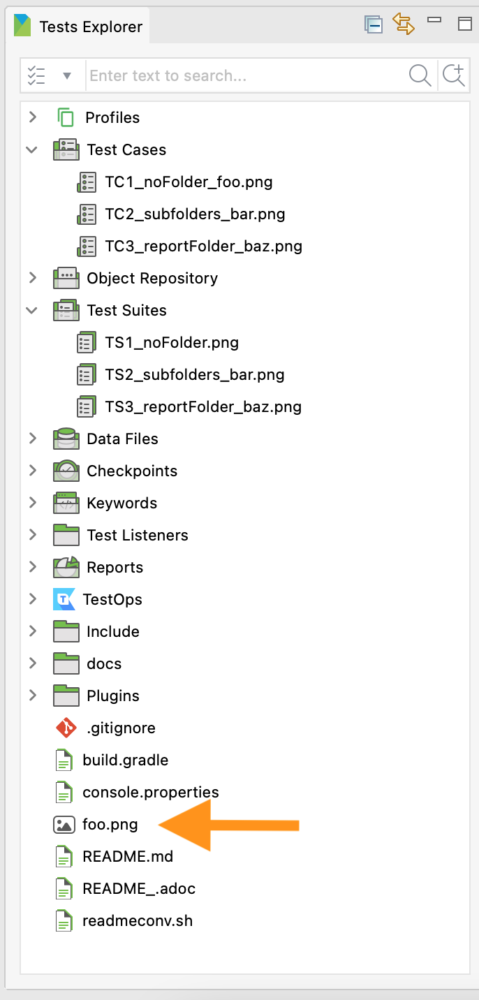
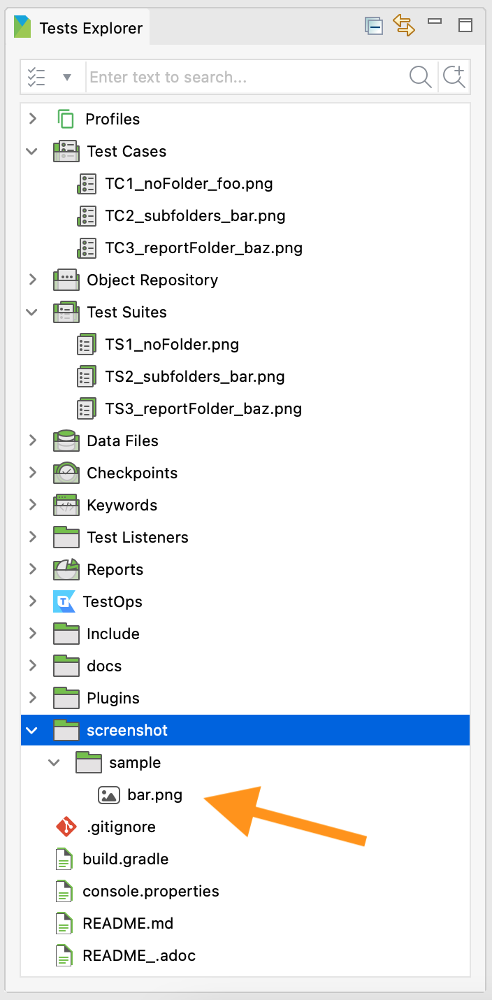
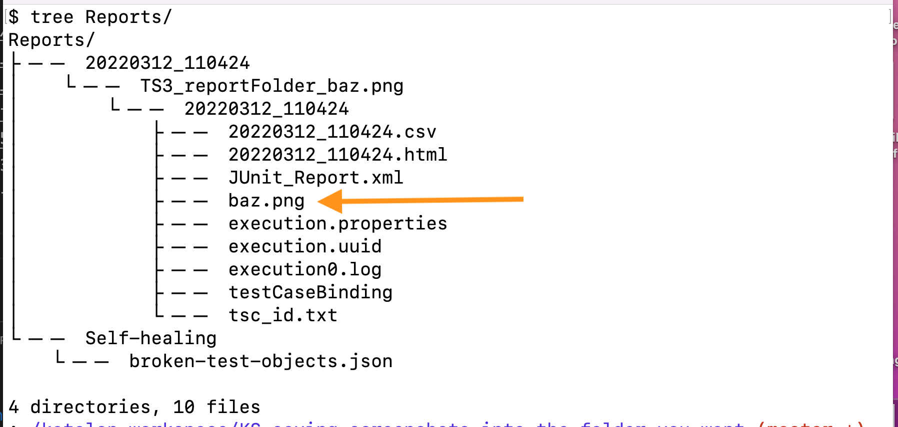
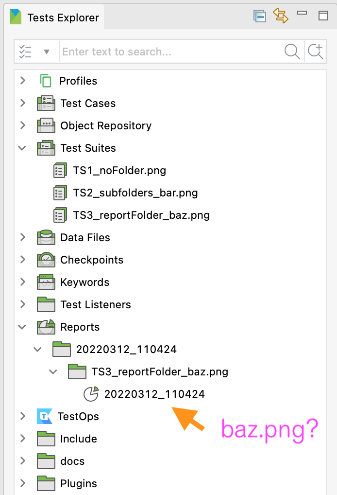

= Saving Screeenshots into the Folder you want in Katalon Studio

This is a Katalon Studio project for demonstration purpose.
You can download the zip from the https://github.com/kazurayam/KS_saving_screenshots_into_the_folder_you_want/releases[Releases] page, unzip it, open it with Katalon Studio on your own PC. This project was tested using Katalon Studio v8.2.5, but it should work on any version.

This project was developed to propose a solution to a question raised in the Katalon User Forum

* https://forum.katalon.com/t/capture-screenshots/57005

== Problem to solve

Katalon Studio provides a set of built-in keywords as documented in the https://docs.katalon.com/katalon-studio/docs/capture-screenshots.html["Capture Screenshots"]. The doc describes only how to take screenshots. But the doc does not describe how to manage the location of png files. For example, the document of WebUI.takeScreenshot() writes:

image:./docs/images/01_doc.png[01_doc]

>fileName: A String that represents the path to the saved image. The path can be an absolute or relative path.

Then, how can I save the PNG file into a specific location I want? For example, if I want to create `<projectDir>/Reports/20220312_100912/baz.png`, how should I write the code? As all Katalon Studio users are aware, the `<projectDir>/Reports/uuuuMMdd_hhmmss` folder is created by Katalon Studio dynamically. Therefore I should not write a constant string literal `20220312_100912` in the script. I need to resolve the folder path dynamically. But how can I do it? The document does not describe this at all.

== Solution

Katalon Studio API provides several methods that help to manage the folder location.

1. https://docs.katalon.com/javadoc/com/kms/katalon/core/configuration/RunConfiguration.html#getProjectDir()[com.kms.katalon.core.configuration.RunConfiguration getProjectDir()]
2. https://docs.katalon.com/javadoc/com/kms/katalon/core/configuration/RunConfiguration.html#getReportFolder()[com.kms.katalon.core.configuration.RunConfiguration getReportFolder()]

You want to use these API in a Test Listener and Test Cases. With these methods your Test Case scripts would be able to control where to save the screenshot images into the folder you want.

== Description

I will show you some sample codes step by step.

=== TS1 specifying no subfolder

The following is the simplest example of using the built-in keyword `WebUI.takeScreenshot(String fileName)`.

[source,groovy]
----
include::Scripts/TC1_noFolder_foo.png/Script1647039633042.groovy[TC1]
----

When you run the Test Suite `TS1_noFolder_foo.png`, you will see a file `foo.png` immediately under the project folder. 

In this case, a String `foo.png` is interpreted to be the file under the *current directory* recognized by the OS where the program ran upon.

>**WARNING** Katalon Studio 8.2.5 has a bug that it can not display files under the project folder when the files are created by test scripts (not by human hand). You need to close the project once and reopen it. Then the `foo.png` will be displayed. See https://forum.katalon.com/t/katalon-studio-does-not-recognise-externally-added-files/61837.

=== TS2 specifying subfolders

You can create arbitrary sub-folders and save your screenshots in it. See the following example.

[source,groovy]
----
include::Scripts/TC2_subfolders_bar.png/Script1647048464599.groovy[TC2]
----

When you run the Test Suite `TS2_subfolders_bar.png`, you will see the folder `screenshots/sample` is created, and inside it a file `bar.png` is saved.

=== TS3 saving png files into the "Reports" folder

Now, let's try to solve a practical scenario. I want to save a PNG file under the "Reports" folder.

First, you want to create a Test Listener.

[source,groovy]
----
include::Test Listeners/TL1.groovy[TL1]
----

Please note that the `TL1` has a `static` property named `reportFolder`.

Katalon Studio always instantiate the `TL1` class before your Test Suites and Test Cases are activated. The `TL1` object sets an appropriate value into the `reportFolder` property by calling `RunConfiguration.getReportFolder()` method.

Then your Test Case `TC3_reportFolder` will refer to the `reportFolder` property of `TL1` object.

[source,groovy]
----
include::Scripts/TC3_reportFolder_baz.png/Script1647043666544.groovy[TC3]
----

When you run the Test Suite `TS3_reportFolder_baz.png`, will see a file `baz.png` is created in the `Reports` folder.

However, you can never see the `baz.png` file in the `Reports` in the Katalon Studio GUI.

This is how Katalon Studio is designed. Katalon Studio does not expect users to save arbitrary files in the `Reports` folder. KS does not display any *unknown* files in the `Reports` folder.

=== How `reportFolder` is set when you run Test Case

When you run the Test Suite `TS3_reportsFolder_baz.png`, you will see the following messages in the Console. Nothing mysterious.

[source]
----
2022-03-12 11:27:09.118 INFO  c.k.katalon.core.main.TestSuiteExecutor  - START Test Suites/TS3_reportFolder_baz.png
...
[Test Suites/TS3_reportFolder_baz.png] projectDir  =/Users/kazuakiurayama/katalon-workspace/KS_saving_screenshots_into_the_folder_you_want
[Test Suites/TS3_reportFolder_baz.png] reportFolder=/Users/kazuakiurayama/katalon-workspace/KS_saving_screenshots_into_the_folder_you_want/Reports/20220312_112659/TS3_reportFolder_baz.png/20220312_112659

2022-03-12 11:27:09.670 INFO  c.k.katalon.core.main.TestCaseExecutor   - --------------------
2022-03-12 11:27:09.670 INFO  c.k.katalon.core.main.TestCaseExecutor   - START Test Cases/TC3_reportFolder_baz.png

[Test Cases/TC3_reportFolder_baz.png] projectDir  =/Users/kazuakiurayama/katalon-workspace/KS_saving_screenshots_into_the_folder_you_want
[Test Cases/TC3_reportFolder_baz.png] reportFolder=/Users/kazuakiurayama/katalon-workspace/KS_saving_screenshots_into_the_folder_you_want/Reports/20220312_112659/TS3_reportFolder_baz.png/20220312_112659
----

On the other hand, when you choose the Test Case `TC3_reportsFolder_baz.png` and run it, you will see the following messages.

[source]
----
2022-03-12 11:30:57.229 INFO  c.k.katalon.core.main.TestCaseExecutor   - --------------------
2022-03-12 11:30:57.233 INFO  c.k.katalon.core.main.TestCaseExecutor   - START Test Cases/TC3_reportFolder_baz.png

[Test Cases/TC3_reportFolder_baz.png] projectDir  =/Users/kazuakiurayama/katalon-workspace/KS_saving_screenshots_into_the_folder_you_want
[Test Cases/TC3_reportFolder_baz.png] reportFolder=/var/folders/7m/lm7d6nx51kj0kbtnsskz6r3m0000gn/T/Katalon/Test Cases/TC3_reportFolder_baz.png/20220312_113053

----

Please remark the difference how the `reportFolder` property is set when you ran the Test Case (not the Test Suite).

[source]
----
reportFolder = /var/folders/7m/lm7d6nx51kj0kbtnsskz6r3m0000gn/T/Katalon/Test Cases/TC3_reportFolder_baz.png/20220312_113053
----

When you choose a Test Case, the `reportFolder` will have a path of temporary directory. This is because Katalon Studio creates a "Report" only for a Test Suite; it does not create "Report" for a Test Case. Therefore the `reportFolder` is given with a harmless value. You are not supposed to refer to it.

== Conclusion

The `TL1` an `TC3_reportFolder_baz.png` shows you how to save a screenshot into Katalon's "Reports" folder.

== Discussion: Wouldn't it be nice if ...

I named screenshot image files as `foo.png`, `bar.png`, `baz.png`. This works. But these names aren't useful.

My script can name the screenshot of URL `http://demoaut.katalon.com/` as `foo.png`. But another script would never be informed that `foo.png` was created out of `http://demoaut.katlaon.com/`. Therefore the file `foo.png` can not be reused by other scripts. **As soon as the screenshot file is created, it becomes a garbage**.

Then, wouldn't it be nice if we could save a screenshot with the file name just the same as the source `http://demoaut.katalon.com/`? like this:

image:docs/images/Wouldnt_it_be_nice.png[Wouldnt_it_be_nice]

As we all know, this is impossible. We can not use the character `/` in file name on any OS --- Windows, Mac, Linux. 

Here we find another problem in saving screenshot as file. *How can we store a screenshot into a file while retaining the metadata such as the source URL associated with the file?* My library https://github.com/kazurayam/materialstore[materialstore] can solve this problem.

@author kazurayam
@date 12 MAR 2022
